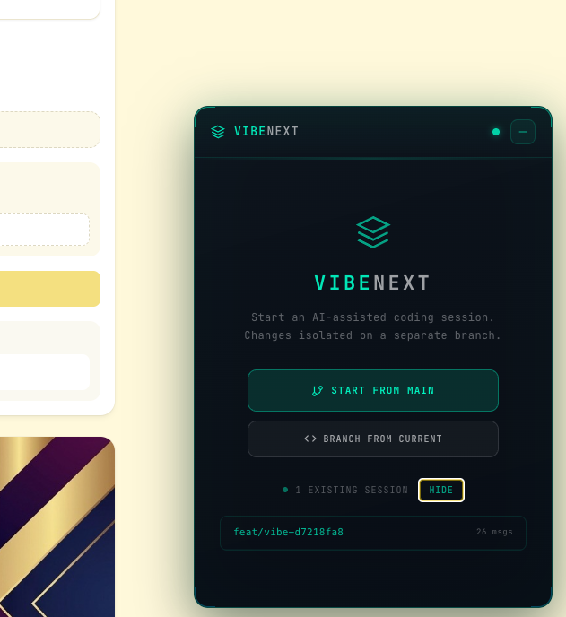

<div align="center">

# Vibe Next

**AI-powered coding assistant that runs as a sidecar to your Next.js app**

Make changes to your codebase on isolated Git branches using Claude — keeping your main branch safe.

[](https://www.npmjs.com/package/vibenext)
[](LICENSE)
[](https://www.typescriptlang.org/)
[](https://nextjs.org/)

[Getting Started](#getting-started) · [Features](#features) · [Configuration](#configuration) · [Contributing](#contributing)

</div>

---

## Overview

Vibe Next adds an AI coding assistant overlay to your Next.js development environment. Each conversation creates an isolated Git branch where Claude can make changes, test ideas, and iterate — all without touching your main branch.


## Getting Started

### Prerequisites

- Node.js 18+
- A Next.js 14+ application
- An [Anthropic API key](https://console.anthropic.com/)

### Installation

```bash
npm install -D vibenext
# or
pnpm add -D vibenext
# or
yarn add -D vibenext
```

### Setup

<details>
<summary><strong>1. Add environment variables</strong></summary>

Create or update `.env.local`:

```env
VIBENEXT_PASSWORD=your_secret_password
ANTHROPIC_API_KEY=your_anthropic_api_key
```

</details>

<details>
<summary><strong>2. Create server actions</strong></summary>

Create `app/actions/vibe.ts`:

```typescript
"use server";

import {
  authenticate as _authenticate,
  checkAuth as _checkAuth,
  createThread as _createThread,
  adoptThread as _adoptThread,
  getCurrentBranch as _getCurrentBranch,
  getThreadState as _getThreadState,
  sendPrompt as _sendPrompt,
  mergeThread as _mergeThread,
  pushThread as _pushThread,
  listThreads as _listThreads,
  switchThread as _switchThread,
  checkHealth as _checkHealth,
} from "vibenext/server-actions";

export async function authenticate(password: string) {
  return _authenticate(password);
}

export async function checkAuth() {
  return _checkAuth();
}

export async function createThread(baseBranch?: string) {
  return _createThread(baseBranch);
}

export async function adoptThread(branchName: string) {
  return _adoptThread(branchName);
}

export async function getCurrentBranch() {
  return _getCurrentBranch();
}

export async function getThreadState(id: string) {
  return _getThreadState(id);
}

export async function sendPrompt(id: string, message: string) {
  return _sendPrompt(id, message);
}

export async function mergeThread(id: string) {
  return _mergeThread(id);
}

export async function pushThread(id: string) {
  return _pushThread(id);
}

export async function listThreads() {
  return _listThreads();
}

export async function switchThread(id: string) {
  return _switchThread(id);
}

export async function checkHealth() {
  return _checkHealth();
}
```

> **Note:** Next.js 14+ requires explicit async function definitions in `"use server"` files. Re-exports like `export * from "..."` are not supported.

</details>

<details>
<summary><strong>3. Add the overlay to your layout</strong></summary>

Update `app/layout.tsx`:

```tsx
import { VibeOverlay } from "vibenext";
import {
  authenticate,
  checkAuth,
  createThread,
  adoptThread,
  getCurrentBranch,
  getThreadState,
  sendPrompt,
  mergeThread,
  pushThread,
  listThreads,
  switchThread,
  checkHealth,
} from "./actions/vibe";

export default function RootLayout({ children }: { children: React.ReactNode }) {
  return (
    <html>
      <body>
        {children}
        <VibeOverlay
          actions={{
            authenticate,
            checkAuth,
            createThread,
            adoptThread,
            getCurrentBranch,
            getThreadState,
            sendPrompt,
            mergeThread,
            pushThread,
            listThreads,
            switchThread,
            checkHealth,
          }}
        />
      </body>
    </html>
  );
}
```

> **Note:** Pass individual functions as a plain object. The overlay automatically disables itself in production.

</details>

<details>
<summary><strong>4. Update your dev script (recommended)</strong></summary>

In your `package.json`, replace the dev script:

```diff
- "dev": "next dev",
+ "dev": "vibenext",
```

Then start your app as usual:

```bash
npm run dev
```

This starts both the Control Plane (port 3001) and Next.js (port 3000).

> **Tip:** You can also run `npx vibenext` directly without modifying package.json.

</details>

## Features

| Feature                | Description                                                |
| ---------------------- | ---------------------------------------------------------- |
| **Isolated Branches**  | Each session creates a new branch (`feat/vibe-{id}`)       |
| **Branch Selection**   | Start from main, branch from current, or continue existing |
| **Auto-commit**        | Changes automatically committed after each AI response     |
| **Session Management** | Switch between multiple unfinished sessions                |
| **Push to Remote**     | Push branches to create PRs                                |
| **Merge to Main**      | One-click merge when you're happy                          |
| **HMR Resilient**      | Control plane survives Next.js hot reloads                 |
| **Production Safe**    | Automatically disabled in production                       |



## Configuration

| Variable                     | Required | Default                 | Description                    |
| ---------------------------- | :------: | ----------------------- | ------------------------------ |
| `VIBENEXT_PASSWORD`          |   Yes    | —                       | Password to access the overlay |
| `ANTHROPIC_API_KEY`          |   Yes    | —                       | Your Anthropic API key         |
| `VIBENEXT_PORT`              |    No    | `3001`                  | Control plane port             |
| `VIBENEXT_CONTROL_PLANE_URL` |    No    | `http://127.0.0.1:3001` | Control plane URL              |
| `VIBENEXT_ANTHROPIC_MODEL`   |    No    | `claude-opus-4-5`       | Anthropic model to use         |

## Security

Vibe Next is a **development-only tool** with automatic production protection:

- `VibeOverlay` returns `null` in production builds
- All API functions refuse to execute in production
- Control plane only binds to localhost (`127.0.0.1`)
- Password authentication via HTTP-only cookies

## Development

```bash
# Install dependencies
pnpm install

# Build the package
pnpm build

# Type check
pnpm typecheck

# Clean build artifacts
pnpm clean
```

## Contributing

Contributions are welcome! Please feel free to submit a Pull Request.

## License

[MIT](LICENSE)

---

<div align="center">

For technical architecture details, see **[Design.md](./Design.md)**

Developed with ♥️ by [Lemonberry Labs](https://lemonberrylabs.com)

</div>
